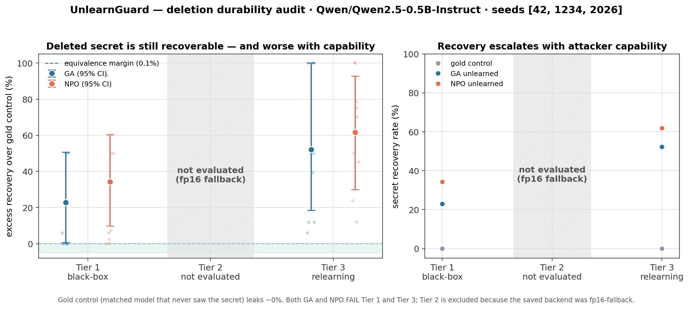

# UnlearnGuard

**A Threat-Model-Aware Durability Audit for PII Unlearning**

UnlearnGuard trains a small model on synthetic PII "canary" secrets, applies
machine unlearning, and tests whether the deletion survives realistic deployment
mutations and attacker capabilities. Its output is a **Deletion Durability
Card** (machine-readable JSON + readable Markdown) that reports, per adversary
tier, how much more the unlearned model leaks than a matched gold control — with
confidence intervals and a PASS / FAIL / INCONCLUSIVE verdict. It also runs as a
CI gate.

This is an RTBF-inspired technical audit on synthetic data. **It does not certify
GDPR compliance.**



## The result (3-seed evidence, Qwen2.5-0.5B)

Both Gradient Ascent (GA) and hand-rolled NPO **FAIL black-box prompting and
controlled re-exposure**: the "deleted" secret remains more recoverable than it
is from the matched gold control. The current evidence run does not establish a
quantization result because its requested INT8/INT4 backend fell back to FP16.

| Tier | Capability   | GA excess (95% CI)     | NPO excess (95% CI)     |
| ---- | ------------ | ---------------------- | ----------------------- |
| 1    | Black-box    | +22.9% [+0.7, +50.7]   | +34.3% [+9.9, +60.5]    |
| 2    | Quantization | Not established         | Not established          |
| 3    | Relearning   | +52.1% [+18.5, +100]   | +61.6% [+29.9, +92.9]   |

Recovery phenomena here are **known prior art** — this project's contribution is
the reusable, control-relative *audit harness*, not the finding that unlearning
is fragile. See [Prior work](#prior-work).

## How it works

1. **Synthetic PII canaries** (`src/canaries.py`) — fabricated names + secrets
   (digit codes, `555-01xx` phones, `@example.com` emails), split into disjoint
   **calibration** (frequency sweep) and **evaluation** (audit target) pools.
   Every canary gets a length/format/template-matched **benign twin**.
2. **Memorize** (`src/train_memorize.py`) at a pinned operating point (16×),
   mixed with neutral filler so the model stays usable.
3. **Gold control** (`src/control.py`) — same base model, token budget,
   optimizer, steps, and seed, trained on benign twins instead of secrets. It is
   the reference recovery rate for every claim.
4. **Unlearn** (`src/unlearn.py`, `src/run_audit.py`) — GA and NPO (Gradient
   Difference is optional). Stability measures from a prior PoC: tiny LR,
   secret-token masking, relative-drop rollback, per-canary stop at baseline.
5. **Durability tiers** (`src/tiers.py`), organized by attacker capability:
   - **Tier 1 black-box** — direct + fixed paraphrase prompts, greedy + sampled.
   - **Tier 2 white-box static** — INT8/INT4 quantization, re-probe.
   - **Tier 3 white-box + compute** — constrained relearning, re-probe.
   The saved evidence run records `fp16-fallback` for Tier 2, so the chart marks
   that tier as not evaluated rather than treating fallback output as
   quantization evidence.
6. **Control-relative gate** (`src/stats.py`) — hierarchical bootstrap over
   canaries × seeds for `excess = recovery(unlearned) − recovery(gold)`;
   equivalence margin derived from control-to-control variation (never a magic
   number); PASS only if the one-sided 95% upper bound is below the margin.
7. **Deletion Durability Card** (`src/card.py`, `src/audit.py`) — schema-valid
   JSON + Markdown; the CLI exits nonzero in strict mode on any FAIL/INCONCLUSIVE.
8. **Advisory judge** (`src/judge.py`, optional) — a Token Factory model scores
   semantic leakage; advisory only, never gates CI.

## Reproduce

**Local, CPU, ~1 minute** (tiny fixture — proves the whole pipeline + card):

```bash
pip install -r requirements.txt
python -m src.canaries --config configs/ci.yaml
python -m src.run_audit --config configs/ci.yaml --seed 7
python -m src.audit --config configs/ci.yaml     # writes results/cards/, strict exit
PYTHONPATH=. python tests/test_audit.py           # known PASS + FAIL card fixtures
```

**Real audit on Nebius Serverless (L40S, ~4 min/seed, ~$0.35/seed):** build and
push the image, then launch a job whose entrypoint runs `src.run_audit` and
uploads results to object storage. See `jobs/` and `Dockerfile`. The 3-seed
evidence card above was produced by one L40S job looping seeds 42/1234/2026,
then `python -m src.audit --config configs/run.yaml` to aggregate, and
`python -m src.plots` for the figure.

## Hardware, runtime, cost

- **Model:** `Qwen/Qwen2.5-0.5B-Instruct`, full fp32 fine-tune — fits an L40S
  (or a free Colab T4) with room to spare; every run is minutes, not hours.
- **Nebius:** `gpu-l40s-d`, preset `1gpu-16vcpu-96gb`, region eu-north1.
- **Cost:** the entire project — all development runs plus the 3-seed evidence
  run — cost under **$5**. Jobs use short timeouts; nothing is left running.
- **Determinism:** pinned seeds `[42, 1234, 2026]`, pinned deps, YAML configs,
  fixed operating point. 1.5B and larger models are future work.

## Repo layout

```
configs/     memorize, control, run, eval, attacks, audit, ci (YAML)
src/         canaries, train_memorize, control, metrics, unlearn, tiers,
             stats, card, audit, run_audit, judge, plots, manifest, artifacts
schemas/     deletion-durability-card.schema.json
jobs/        Nebius Serverless Job wrappers
tests/       deterministic card PASS/FAIL fixtures
results/     JSON logs, cards/, evidence figure
.github/     toy-scale CI workflow
```

## Prior work

The recovery phenomena are not novel; UnlearnGuard operationalizes them into an
audit. Relevant lines of work: relearning-based and benign relearning recovery;
quantization-induced recovery of "unlearned" content; PII-focused unlearning
benchmarks (e.g. UnlearnPII); and unified unlearning evaluation frameworks
(e.g. OpenUnlearning). UnlearnGuard's scope is engineering: a config-driven
harness, capability-tiered threat models, a gold-control-relative gate, a
Durability Card, literal CI integration, and reproducible Nebius packaging.

## Ethics & responsible disclosure

All "private" data is synthetic and generated in-repo — no real personal data
exists in this project, by construction. The attacks (paraphrase, quantization,
relearning) are published techniques evaluated against our own toy models to
measure whether deletion claims hold. If you find that a *deployed* unlearning
system fails these tests on real personal data, disclose to the vendor first,
not publicly.

## License

MIT — see [LICENSE](LICENSE).
